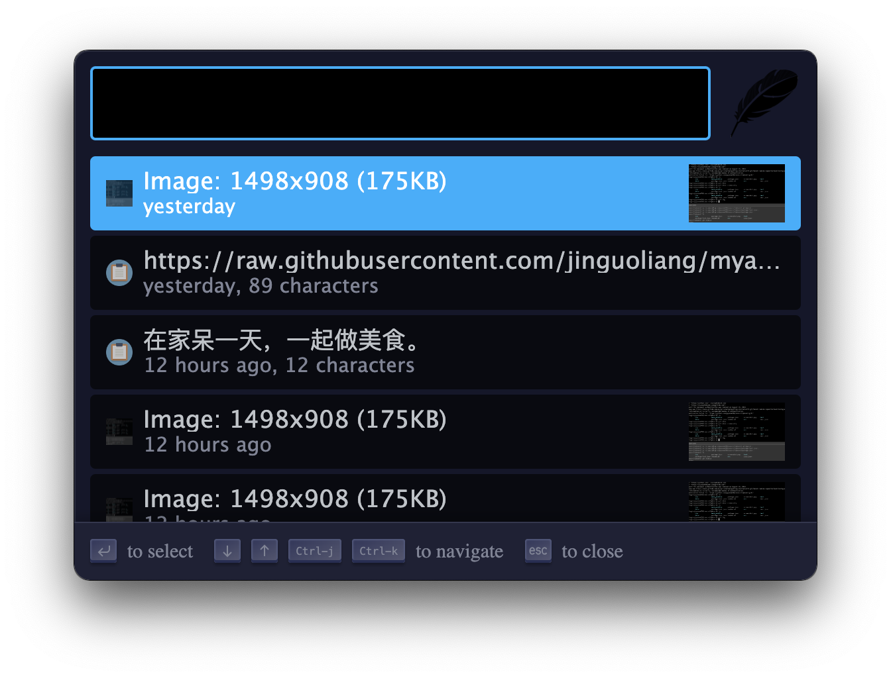

## Clipboard manager for Zazu

Remembers the things you've copied into your clipboard, and gives it back in a
searchable format.

## Usage

Most commonly this is opened with a keyboard shortcut `cmd+shift+v`, which can
be overwritten. Simply hit this key and you'll immediately be shown your recent
clips that can be searched.

## Installing

Add the package to your plugins array in `./zazurc.json`.

~~~ json
{
  "plugins": [
    "pysnow530/zazu-clipboard"
  ]
}
~~~

You can overwrite the keyboard shortcut by defining a variable with the name
`ClipboardKey`.

~~~ json
{
  "name": "pysnow530/zazu-clipboard",
  "variables": {
    "ClipboardKey": "alt+shift+v"
  }
}
~~~

By default we remember the last 50 items in your clipboard. To change this add a
`size` variable to your configuration.

~~~ json
{
  "name": "pysnow530/zazu-clipboard",
  "variables": {
    "size": 1000
  }
}
~~~
